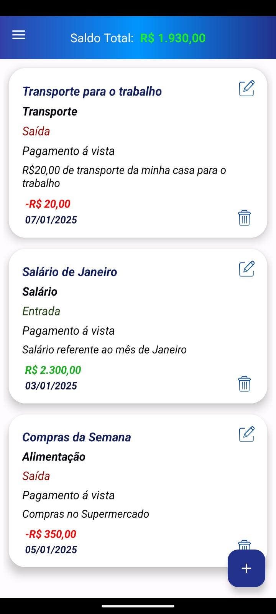
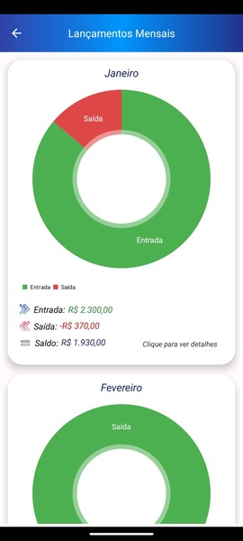
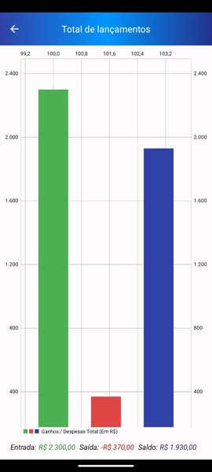
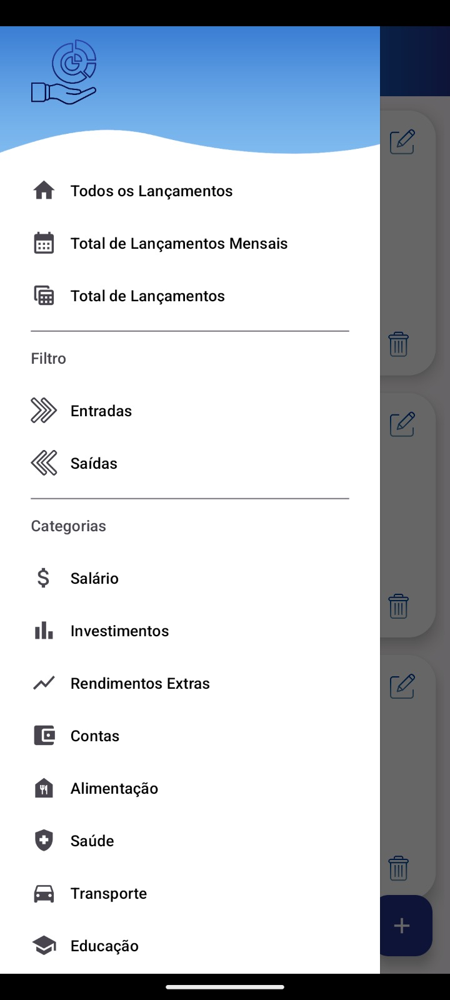

# 📊 Controle de Gastos

O Aplicativo Android nativo Controle de Gastos foi desenvolvido para auxiliar o usuário a gerenciar suas finanças pessoais de forma simples e eficiente.  
Nesta aplicação o usuário é capaz de regsitrar todas as suas entradas e saídas, seus ganhos e gastos, visualizar gráficos interativos e ter uma visão clara de seu controle financeiro ao longo de 12 meses!

## 🚀 Funcionalidades

 ✅ Cadastro de entradas e saídas, registro de todos os ganhos e gastos de um determinado período.

 ✅ Informações que formam cada registro:
  - Fluxo da operação (Entrada ou Saída)
  - Descrição
  - Valor da operação
  - Data da operação
  - Forma de pagamento
  - Categoria da operação

 ✅ Categorias personalizadas para cada operação:
  - Salário, Investimentos, Rendimentos Extras, Contas, Alimentação, Saúde, Transporte, Lazer e Entretenimento, Educação, Outros

 ✅ Visualização de gráficos interativos:
  - Resumo mensal e anual completo de todos as movimentações financeiras registradas.

 ✅ Histórico detalhado de transações.

 ✅ Simples e fácil de utilizar, buscando a melhor experiência possível do usuário ao utilizar a aplicação.

 ✅ Performance otimizada com operações assíncronas utilizando **Coroutines**, evitando travamentos da UI.

## 🛠️ Stack Tecnológica utilizada neste projeto

- **Kotlin** — Linguagem principal de desenvolvimento
- **Room Database** — Persistência de dados local
- **MVVM (Model-View-ViewModel)** — Arquitetura modular e escalável
- **Repository Pattern** — Abstração da camada de dados
- **Dagger Hilt** — Injeção de dependências simplificada
- **Coroutines** — Operações assíncronas e concorrência
- **MPAndroidChart** — Gráficos interativos e personalizáveis
- **JUnit & Mockito** — Testes unitários
- **Espresso** — Testes de interface automatizados

