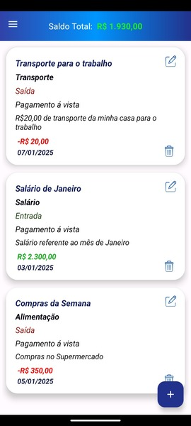

# 📊 Controle de Gastos

O Aplicativo Android nativo Controle de Gastos foi desenvolvido para auxiliar o usuário a gerenciar suas finanças pessoais de forma simples e eficiente.  
Nesta aplicação o usuário é capaz de registrar todas as suas entradas e saídas, seus ganhos e gastos, visualizar gráficos interativos e ter uma visão clara de seu controle financeiro ao longo de 12 meses!

## 🚀 Funcionalidades

 ✅ Cadastro de entradas e saídas, registro de todos os ganhos e gastos de um determinado período.

 ✅ Informações que formam cada registro:
  - Fluxo da operação (Entrada ou Saída)
  - Descrição
  - Valor da operação
  - Data da operação
  - Forma de pagamento
  - Categoria da operação

 ✅ Categorias personalizadas para cada operação:
  - Salário, Investimentos, Rendimentos Extras, Contas, Alimentação, Saúde, Transporte, Lazer e Entretenimento, Educação, Outros

 ✅ Visualização de gráficos interativos:
  - Resumo mensal e anual completo de todas as movimentações financeiras registradas.

 ✅ Histórico detalhado de transações.

 ✅ Simples e fácil de utilizar, buscando a melhor experiência possível do usuário ao utilizar a aplicação.

 ✅ Performance otimizada com operações assíncronas utilizando **Coroutines**, evitando travamentos da UI.

## 🛠️ Stack Tecnológica utilizada neste projeto

- **Kotlin** (1.8.20) — Linguagem principal de desenvolvimento.
- **Room Database** (2.5.2) — Persistência de dados local.
- **MVVM (Model-View-ViewModel)** — Arquitetura modular e escalável.
- **LiveData** — Para dados observáveis conscientes ao ciclo de vida.
- **Repository Pattern** — Abstração da camada de dados.
- **Dagger Hilt** (2.51.1) — Injeção de dependências simplificada.
- **Coroutines** (coroutines-test:1.7.3) — Operações assíncronas e concorrência.
- **MPAndroidChart** (3.1.0) — Gráficos interativos e personalizáveis.
- **JUnit & Mockito** (4.13.2/1.1.5),(5.2.0)— Testes unitários.
- **Espresso** (3.5.1) — Testes de interface automatizados.

- **Versão do Android Studio** — 2024.3.1 Patch 2
- **Versão do Gradle** — 8.11.1

## 📫 Contato

- Email: gustavoteixeira.ggt@gmail.com

